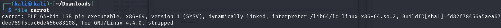
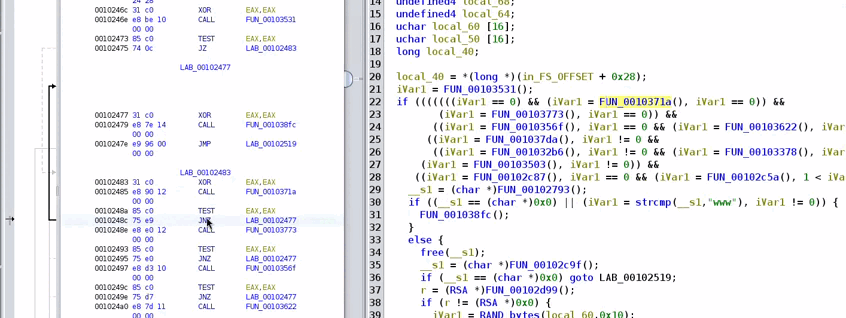

# Carrot (reverse category)

> Written by: Saad484
> 



The  `carrot` binary is:

- **64-bit ELF** executable
- **Position Independent Executable (PIE)** (meaning ASLR applies)
- **Dynamically linked** (depends on shared libraries)
- **Stripped** (debug symbols removed)
    
    ***PIE (Position Independent Executable)** is type of binary that can be loaded into different memory addresses each time it is run. This feature enhances security by making it difficult for attackers to perdict where the executable is code is located in the memory, thereby mitigating certain type of exploits like return-to-libc attacks.*
    
- Running strings gives us some interesting result some urls, curls and from the result we can segguset that malware is sending doing something with web requests (wish is peredictable in a peace  malware )
- Now let’s use ghidra in order to disassemble and decompile the malware


- looking at the symbole tree we can see any `main` function witch may sounds confusing


- to find the main function we can go to the entry function  and look at the decompiled code, which look something like this:


- __libc_start_main() is used to initialize the runtime env before calling the main function. The function to be treated as the main func is usually the first argument in a call to __libc_start_main().
- In our case, FUN_00102450 is the first arg, so we can double click it to rename as main or just by pressing L we can rename the function to ‘main’, which will assist în understanding how the binary works as we continue to analyze it.

```c
undefined4 main(void)

{
  int iVar1;
  char *__s1;
  RSA *r;
  size_t sVar2;
  char *__ptr;
  void *__ptr_00;
  undefined8 extraout_RAX;
  undefined4 uVar3;
  long in_FS_OFFSET;
  undefined4 local_68;
  undefined4 local_64;
  uchar local_60 [16];
  uchar local_50 [16];
  long local_40;
  
  local_40 = *(long *)(in_FS_OFFSET + 0x28);
  iVar1 = FUN_00103531();
  if (((((((iVar1 == 0) && (iVar1 = FUN_0010371a(), iVar1 == 0)) &&
            (iVar1 = FUN_00103773(), iVar1 == 0)) &&
           ((iVar1 = FUN_0010356f(), iVar1 == 0 && (iVar1 = FUN_00103622(), iVar1 == 0)))) &&
          ((iVar1 = FUN_001037da(), iVar1 != 0 &&
           ((iVar1 = FUN_001032b6(), iVar1 != 0 && (iVar1 = FUN_00103378(), iVar1 == 0)))))) &&
        (iVar1 = FUN_00103503(), iVar1 != 0)) &&
       ((iVar1 = FUN_00102c87(), iVar1 == 0 && (iVar1 = FUN_00102c5a(), 1 < iVar1)))) {
     __s1 = (char *)FUN_00102793();
     if ((__s1 == (char *)0x0) || (iVar1 = strcmp(__s1,"www"), iVar1 != 0)) {
        FUN_001038fc();
     }
     else {
        free(__s1);
        __s1 = (char *)FUN_00102c9f();
        if (__s1 == (char *)0x0) goto LAB_00102519;
        r = (RSA *)FUN_00102d99();
        if (r != (RSA *)0x0) {
           iVar1 = RAND_bytes(local_60,0x10);
           if (iVar1 != 0) {
              iVar1 = RAND_bytes(local_50,0x10);
              if (iVar1 != 0) {
                 sVar2 = strlen(__s1);
                 __ptr = (char *)FUN_00102dd6(__s1,sVar2 & 0xffffffff,local_60,local_50,&local_68);
                 free(__s1);
                 if (__ptr == (char *)0x0) {
                    RSA_free(r);
                    goto LAB_00102519;
                 }
                 __ptr_00 = (void *)FUN_00102ecd(r,local_60,&local_64);
                 RSA_free(r);
                 __s1 = __ptr;
                 if (__ptr_00 != (void *)0x0) {
                    FUN_00103029(__ptr,local_68,__ptr_00,local_64,local_50,0x10,local_60,extraout_RAX);
                    free(__ptr);
                    free(__ptr_00);
                    uVar3 = 0;
                    goto LAB_0010260d;
                 }
                 goto LAB_00102514;
              }
           }
           RSA_free(r);
        }
     }
LAB_00102514:
     free(__s1);
  }
  else {
     FUN_001038fc();
  }
LAB_00102519:
  uVar3 = 1;
LAB_0010260d:
  if (local_40 == *(long *)(in_FS_OFFSET + 0x28)) {
     return uVar3;
  }
                            /* WARNING: Subroutine does not return */
  __stack_chk_fail();
```

- From this main func we can see a giant if-else statement wish appear checking the various return values of functions, Also we can see a reference to an RSA
- The first function called in the if-else block is `iVar1 = FUN_00103531();`

Taking a look on it 


The function **FUN_00103531()** is using `ptrace()` to **detect if a debugger is attached**.

1. The program **calls `ptrace(PTRACE_TRACEME, 0, 0, 0)`**:
    - If **no debugger** is present, `ptrace()` returns `0`, and the program continues.
    - If a **debugger is attached**, `ptrace()` returns `1`.
2. The program checks the return value:
    - If **`ptrace()` returns `1`**, it **prints an error message (`perror("ptrace")`)** and **likely stops execution**.
    - Otherwise, it **detaches from itself (`ptrace(PTRACE_DETACH, 0, 0, 0)`)** and keeps running.

### Sleep patching

- the next `FUN_0010371a` function take time from the system  sleeping for 150 seconds (0x96 in decimal value), after the sleep time is over it start calculating the amount of time that has been passed btw the storted timestamps. if the time elapsed is close enough to 150 seconds, then execution will continue, otherwise, the function will return false, causing the main function to fail.

```c
bool FUN_0010371a(void)

{
  time_t __time0;
  time_t __time1;
  double dVar1;
  
  __time0 = time((time_t *)0x0);
  if (__time0 != -1) {
     sleep(0x96);
     __time1 = time((time_t *)0x0);
     if (__time1 != -1) {
        dVar1 = difftime(__time1,__time0);
        if (dVar1 < 149.95) {
           return true;
        }
        return 150.25 < dVar1;
     }
  }
  return false;
}

```

- So what will do we’ll patch the binary to sleep for one second instead.

what will do is that we will change the value of the sleep time from 150 to 1 s.


but the check will still fail. and in order to deal with that we should go back to the main function and locate the expression that evaluates the return value of the function `[(iVar1 = FUN_0010371a(), iVar1 == 0)]` 

and look at the assembly 


- we can see that after calling the check function, the program executes a JNZ instruction, which will redirect execution to  `LAB_00102477` if `EAX` isn’t zero.
- so we can simply change the instruction from JNZ to JZ and then save. This will cause the program to continue executing if EAX isn’t zero. we can also see the de-compiler change the exepression to `(iVar1 =UN_0010371a(), iVar1 != 0)`





Ctrl+shift+G shortcut to edit on the instruction

- The next func that gets executed is `(iVar1 = FUN_00103773(), iVar1 == 0)` , it smilaire to the prev one but here it used do-while loop to simulate sleep(). Nevertheless, we can do the same trick as with the first one by changing the storted value and patching the corresponding conditional experssion in main() to JZ instruction.
- Here, we’ll look at the while part of the do while loop, wich runs the loop while the time difference is less that 150.0 seconds.


- the program moves a pointer to some (`DAT_00104498`) to the register XMM2,  then does a comparision btw XMM2 and XMM0, witch will jump back to the beginning of the loop  `LAB_00103788` if the condition (the time difference being less than 150 .0  Seconds) is met.
- in order to change the data storted in the program we double click on the `DAT_00104498` to take us to the data storted in the program:
- in ghidra when we undefind that the mean that he could’t resolve thet data type but from the instruction we can see that `COMISD` witch used in assembly to compaire the doubles values types.


### *Now let’s see with Anti vm checks*

we have the  `FUN_0010356f`  that execute fopen(”/proc/cpuinfo”, “r”) and check for VM by search the presence of the string **hypervisor.** and this essentially checking the program is running in a vm causing the check to fail.

→ this just for reference how to check if your code is running inside a VM  | https://stackoverflow.com/questions/51911300/c-convenient-way-to-check-if-system-is-a-virtual-machine


- Same thing for  `FUN_00103622` opens a various system file then it check for the strings “VMWare”, “VirtaulBox” And “QEMU”. to bypass this we can do teh same patching strategy as befor and change the JNZ to JZ ones.


### Internet connectivity + Kill switch check


The function `FUN_001037d` causes the binary to visit the urls and checks the http status response codes for each one. for the first url the the checks passes if it accessible (response code 200), while connceted to the internet, we have to trick it into thinking the second url isn’t accessible.

we can do that by setting up with DNS so that the url can’t be resolved or patch the binary to change the comparision to return true if the url is accessible,  but tif we try to curl the website ourselves, we’ll see that it can’t be resolved,wich mean actually we don”t need to do anythong 😊.

   


### IP address check

`FUN_001032b6()` executes the following snippet:


the function getifaddrs() gets a linkedlist containing information about all the network interfaces on the system. Assusming that function executes successfully, the porgram will then loop through each entry in the linked list and use getnameinfo() to retrieve the ip address contains “10.13.37” from each socket using strncmp to check if exists, meaning that our machine have to have an address using those fisrt three octets;

but we can use the trick to get over this right 😜?   this time JZ to JNZ.


### Process check


`FUN_00103378()` starts off by opening the `/proc` directory. It then iterates through each process, reading the contents of the `cmdline`. This, combined with the strings “gdb”, “wireshark”, “strace”, and other debugging tools, leads us to infer that the program is checking for whether certain programs are running, and will likely terminate execution if those programs are running. The odd one out is “apache2”, which if found will set the return value to zero before closing the loop, thereby passing the check. Therefore, it is reasonable to assume that we don’t want any debugger programs running but have apache2 running.

We *could* start up apache2, but given how we’ve treated the past checks, we’ll just patch it out instead.

### Username check

- this `FUN_00103503` check uses **getuid()** and **getpwuid()** to get the username of the user that the  ****process is running under. if the username isn’t **metactf** the check fails.


so here i simply JZ to JNZ

let’s move on !!

### Fan check ???

fun fact did u know that in VM there is no FANs 😇 just emulate


Well this is interesting. After doing some research, we can conclude that the strings being referenced here are actually directories that Linux uses to store sensor and device information. Looking into `FUN_00102b47()`, we can see the string “fan” amongst all the code, leading us to believe that this function is looking for fans. Based on this and the fact that the function returns an integer, we can conclude that the function is checking for the number of fans present on the machine, which in a VM would be zero. The comparison expression is `1 < iVar1`, which actually checks whether the number of fans is greater than or equal to 2.

We just have to patch this check like the others, taking care to flip the `JLE` instruction to `JGE` instead.


### Hostname check

`FUN_00102793()` grabs the hostname of the machine, with the actual check happening in `main()` via `(iVar1 = strcmp(__s1,"www"), iVar1 != 0)`. The program is essentially checking whether the hostname of the machine is “www”, in which case the check will pass. We’ll patch it and move on.


### last patch

If data about the system is being sent out, our patches in the main function of the program aren’t going to be enough, as there is likely some server-side validation happening.

In order to defeat this, we have a number of options. We could try and override the functions, we could try and patch them, or…we could take a closer look at the four if-statements. These statements check the return values of the functions, or more specifically, the variables that hold them. If a variable contains nothing, then the program enters the string “unknown” instead. What if we abused this to store our own strings?

If we modify the check logic and change the address of the string that’s loaded into a variable to one that the program already has using the techniques described previously, we can alter the contents of the variables! We already know what strings we need considering they’ve been used in previous checks.

This is what the source code block should look like after our patches:

```
    if (__ptr_02 != (char *)0x0) {
      __ptr_02 = "apache2";
    }
    if (__ptr_01 != (char *)0x0) {
      __ptr_01 = "meatctf";
    }
    if (__ptr_00 != (char *)0x0) {
      __ptr_00 = "www";
    }
    if (__ptr != (char *)0x0) {
      __ptr = "10.13.37";
    }

```

Furthermore, we can edit the JSON string and change the `"fan_count"` field from `%d` to a number, say 4. This works because our edit there won’t exceed the memory already allocated to the string, as opposed to trying to change the `"username"` field from `%s` to `"meatctf"`.

After making all our changes, we can press `O`, which brings up an export menu. Choosing `Original File` will save the modified program in its original format, which we can then run (make sure to run `chmod +x` first!).

After all our hard work, we can run the program and are greeted with the flag:

```
MetaCTF{y0u_g0t_7h3_meats}
```